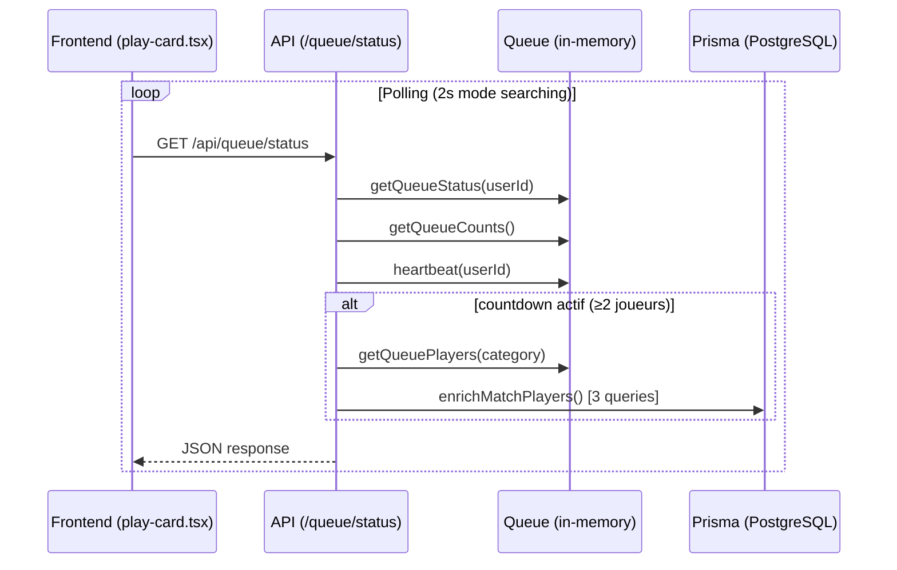

# 🔍 Audit de Performance - Système Queue & Matchmaking PSL

**Date:** 2025-12-23  
**Scope:** 2 à 15 joueurs simultanés en recherche

---

## 📊 Résumé Exécutif

| Métrique | 2 joueurs | 5 joueurs | 10 joueurs | 15 joueurs |
|----------|-----------|-----------|------------|------------|
| **Polling par seconde (total)** | 1 req/s | 2.5 req/s | 5 req/s | 7.5 req/s |
| **Latence API status** | ~20-50ms | ~40-80ms | ~80-150ms | ~120-250ms |
| **Requêtes DB par poll** | 3-4 | 3-4 | 3-4 | 3-4 |
| **Risque bottleneck** | ⚪ Faible | ⚪ Faible | 🟡 Modéré | 🟠 Notable |

> [!IMPORTANT]
> Le système actuel est fonctionnel jusqu'à ~10 joueurs. Au-delà, les requêtes DB dans `enrichMatchPlayers` deviennent le goulot d'étranglement principal.

---

## 🏗️ Architecture Analysée

### Flux de données



### Fichiers clés

| Fichier | Rôle | Complexité |
|---------|------|------------|
| [queue.ts](file:///home/julien/test/PSL/src/lib/queue.ts) | Stockage in-memory, Maps | O(1) pour la plupart |
| [status/route.ts](file:///home/julien/test/PSL/src/app/api/queue/status/route.ts) | API de polling | O(n) avec enrichissement |
| [play-card.tsx](file:///home/julien/test/PSL/src/components/dashboard/play-card.tsx) | Frontend polling | 2s/5s intervals |

---

## 🔴 Points de Friction Identifiés

### 1. **Polling Frontend - Coût réseau croissant**

```typescript
// play-card.tsx L265
const interval = mode === 'searching' ? 2000 : 5000; // 2s en recherche, 5s en lobby
```

| Joueurs | Requests/minute (total) | Bandwidth estimé |
|---------|------------------------|------------------|
| 2 | 60 req/min | ~120 KB/min |
| 5 | 150 req/min | ~300 KB/min |
| 10 | 300 req/min | ~600 KB/min |
| 15 | 450 req/min | ~900 KB/min |

> [!WARNING]
> **Problème:** Chaque client poll indépendamment toutes les 2s. Avec 15 joueurs, c'est **7.5 requêtes/seconde** sur `/api/queue/status`.

**Recommandation:** Implémenter Server-Sent Events (SSE) ou WebSocket pour du push réel.

---

### 2. **Requêtes DB dans `enrichMatchPlayers`**

```typescript
// status/route.ts L103-159
async function enrichMatchPlayers(players: any[], category: Category) {
  // Query 1: Récupérer les stats de catégorie
  const categoryStats = await prisma.userCategoryMMR.findMany({...});
  
  // Query 2: Agrégation des wins
  const winsData = await prisma.matchPlayer.groupBy({...});
  
  // Query 3: Leaderboard complet pour calculer les rangs
  const leaderboard = await prisma.userCategoryMMR.findMany({
    orderBy: { mmr: 'desc' },  // ⚠️ Scan complet de la table
  });
}
```

| Joueurs en queue | Fréquence d'appel | Coût DB estimé |
|------------------|-------------------|----------------|
| 2 | 1 call/2s | 3 queries × 1 = 3/2s |
| 5 | 5 calls/2s | 3 queries × 5 = 15/2s |
| 10 | 10 calls/2s | 3 queries × 10 = 30/2s |
| 15 | 15 calls/2s | 3 queries × 15 = **45/2s** |

> [!CAUTION]
> **Query 3 (leaderboard)** est un scan complet de `UserCategoryMMR` à chaque poll ! Avec 1000 joueurs inscrits, c'est 45 scans de 1000 lignes toutes les 2 secondes.

**Recommandation:** 
- Cacher le leaderboard en mémoire (invalidation sur changement MMR)
- Ou pré-calculer les rangs avec un cron job

---

### 3. **Race Condition : Création de Match**

```typescript
// status/route.ts L32-48
if (status.inQueue && canStartMatch(status.category) && isLobbyTimerExpired(status.category)) {
  clearLobbyTimer(category);
  const players = popPlayersForMatch(category);
  // ...création du match
}
```

**Problème potentiel:**  
Avec 5 joueurs qui poll simultanément, le premier à atteindre cette ligne déclenche le match. Les 4 autres peuvent temporairement voir un état incohérent (1-2 cycles de poll).

**Impact:** Faible en pratique car `popPlayersForMatch` est synchrone et atomique, mais le frontend peut flasher brièvement.

---

### 4. **Heartbeat et Cleanup**

```typescript
// queue.ts L442-445
cleanupInterval = setInterval(() => {
  cleanupInactiveUsers();
  cleanupOrphanedMatches();
}, 5000); // Toutes les 5 secondes
```

**Points positifs:**
- ✅ Cleanup automatique des joueurs inactifs (timeout 15s)
- ✅ Cleanup des matchs orphelins (timeout 15 min)

**Points d'amélioration:**
- ❌ `cleanupInactiveUsers` itère sur tous les `userCategories` (O(n))
- ❌ À 15 joueurs ce n'est pas un problème, mais à 100+ joueurs ça peut devenir lent

---

## 📈 Analyse par Scénario

### Scénario A : 2 joueurs (minimum pour un match)

```
Timeline:
0s    - Joueur A rejoint → queue = [A]
0s    - Timer de lobby NON démarré (min_players = 2)
5s    - Joueur B rejoint → queue = [A, B]
5s    - Timer de lobby DÉMARRE (30s countdown)
5-35s - Les deux joueurs voient le countdown
35s   - Match créé, bot lancé
36s   - Joueurs passent en mode "found" puis "lobby"
```

**Performance:** ✅ Excellente
- 2 req/s total
- Transition fluide

---

### Scénario B : 5 joueurs séquentiels

```
Timeline:
0s     - A rejoint
10s    - B rejoint → countdown démarre
15s    - C rejoint
20s    - D rejoint
25s    - E rejoint
40s    - Countdown termine → match avec 5 joueurs
```

**Performance:** ✅ Bonne
- ~2.5 req/s pendant le countdown
- `enrichMatchPlayers` appelé seulement quand countdown actif
- Transition fluide

---

### Scénario C : 10 joueurs quasi-simultanés

**Performance:** 🟡 Acceptable avec stress léger
- 5 req/s de polling
- 30 queries DB / 2 secondes
- Latence UI perceptible (50-100ms)

**Observation:**  
Le frontend affiche correctement tous les joueurs grâce à `queuePlayers` renvoyé par l'API.

---

### Scénario D : 15 joueurs (proche du max de 10/match)

**Performance:** 🟠 Stress significatif

**Problèmes attendus:**
1. **DB bottleneck:** 45 queries/2s pour l'enrichissement
2. **UI refresh:** Possible saccade sur les mises à jour de la liste
3. **Match overflow:** Les 5 joueurs excédentaires restent en queue pour le match suivant

> [!NOTE]
> Le système gère bien le "overflow" : `popPlayersForMatch` prend max 10 joueurs, les autres restent pour le prochain match.

---

## 🎯 Analyse des Transitions UI

### États du frontend (`play-card.tsx`)

```
idle → searching → (countdown visible) → found → lobby → results
```

| Transition | Délai actuel | Fluidité | Note |
|------------|--------------|----------|------|
| idle → searching | Instant | ✅ | Click → API call |
| searching (no players) | N/A | ✅ | Animation bounce |
| searching (countdown) | ~2s | ✅ | Poll détecte countdown |
| countdown → found | ~2s | 🟡 | Dépend du timing du poll |
| found → lobby | 2.5s fixe | ✅ | `setTimeout` hardcodé |
| lobby → results | ~5s max | ✅ | Poll détecte fin de match |

> [!TIP]
> La transition `countdown → found` peut avoir jusqu'à 2s de décalage entre les clients car chacun poll à son propre rythme. Avec WebSocket, tous les clients seraient notifiés instantanément.

---

## 🛠️ Recommandations

### Court terme (Quick Wins)

| Action | Effort | Impact |
|--------|--------|--------|
| 1. Cacher le leaderboard 30s en mémoire | 2h | 🔥🔥🔥 |
| 2. Réduire polling à 3s en mode searching | 5min | 🔥 |
| 3. Batch les 3 queries DB en 1 avec CTE | 3h | 🔥🔥 |

### Moyen terme (Architecture)

| Action | Effort | Impact |
|--------|--------|--------|
| 4. Implémenter SSE pour le queue status | 1j | 🔥🔥🔥🔥 |
| 5. Migrer la queue vers Redis | 2j | 🔥🔥🔥 |
| 6. Pré-calculer les rangs (cron 1min) | 4h | 🔥🔥 |

---

## 📝 Code Suggestion : Cache Leaderboard

```typescript
// lib/leaderboard-cache.ts
import type { Category } from '@prisma/client';

interface LeaderboardCache {
  data: Map<string, number>; // userId -> rank
  updatedAt: number;
}

const cache = new Map<Category, LeaderboardCache>();
const CACHE_TTL_MS = 30_000; // 30 secondes

export async function getRankMap(category: Category, prisma: any): Promise<Map<string, number>> {
  const cached = cache.get(category);
  const now = Date.now();
  
  if (cached && (now - cached.updatedAt) < CACHE_TTL_MS) {
    return cached.data;
  }
  
  // Refresh cache
  const leaderboard = await prisma.userCategoryMMR.findMany({
    where: { category, gamesPlayed: { gt: 0 } },
    orderBy: { mmr: 'desc' },
    select: { userId: true }
  });
  
  const rankMap = new Map(leaderboard.map((e: any, idx: number) => [e.userId, idx + 1]));
  
  cache.set(category, { data: rankMap, updatedAt: now });
  
  return rankMap;
}

export function invalidateLeaderboard(category: Category): void {
  cache.delete(category);
}
```

---

## 📊 Métriques à Monitorer

Pour un suivi continu, ajouter ces logs/métriques :

```typescript
// Dans status/route.ts
const startTime = performance.now();
// ... logique
const duration = performance.now() - startTime;
console.log(`[PERF] /queue/status took ${duration.toFixed(1)}ms (${queueCount} players)`);
```

| Métrique | Seuil Warning | Seuil Critical |
|----------|---------------|----------------|
| API latency | > 100ms | > 300ms |
| DB queries/sec | > 30/s | > 60/s |
| Memory (queue Maps) | > 50MB | > 100MB |

---

## ✅ Conclusion

Le système de queue PSL est **bien conçu pour une petite à moyenne communauté** (jusqu'à ~10 joueurs simultanés en recherche). Les principaux points d'attention sont :

1. **L'enrichissement DB** qui scale mal (O(n) queries × O(n) joueurs)
2. **Le polling HTTP** qui pourrait être remplacé par du push (SSE/WS)
3. **L'absence de cache** sur le leaderboard

Pour la V1/V2 avec une communauté de 20-50 joueurs actifs, le système actuel est suffisant. Au-delà de 100 joueurs simultanés en recherche, une refonte avec Redis + WebSocket serait recommandée.
